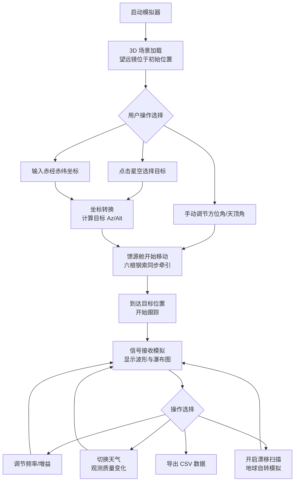

## 1. 产品概述

基于 Three.js 的 3D 射电望远镜观测模拟器，模拟 FAST（中国天眼）等大型射电望远镜的工作过程。用户可交互控制望远镜指向、观测天体目标、模拟信号接收与数据记录，提供沉浸式天文观测教学与演示体验。

- 主要用途：天文科普教育、射电望远镜工作原理演示、观测数据可视化
- 目标用户：学生、天文爱好者、科普场馆访客

## 2. 核心功能

### 2.1 功能模块
1. **3D 主场景**：山谷地形、射电望远镜模型（反射面、馈源舱、六根钢索牵引机构）、星空背景
2. **望远镜控制系统**：馈源舱运动控制、天顶角/方位角指向、自动跟踪目标
3. **目标选择系统**：交互式星空点击选星、赤经赤纬手动输入、天体坐标转换
4. **信号接收模拟器**：实时波形显示（正弦波/脉冲）、频率与增益调节、信噪比显示
5. **漂移扫描模式**：望远镜固定指向，模拟地球自转带目标扫过波束
6. **数据可视化**：实时瀑布图（二维频谱图）、观测数据记录
7. **环境系统**：天气切换（晴/雾/雨）、观测质量评分
8. **数据导出**：信号数据导出为 CSV 格式
9. **状态显示面板**：实时指向坐标、跟踪状态、观测参数

### 2.2 页面详情

| 页面名称 | 模块名称 | 功能描述 |
|---------|---------|---------|
| 主界面 | 3D 场景视图 | 显示山谷中的射电望远镜、星空背景，支持鼠标拖拽旋转视角 |
| 主界面 | 控制面板 | 天顶角/方位角输入、目标搜索、频率/增益调节、天气切换 |
| 主界面 | 信号波形区 | 实时显示接收到的信号波形，可切换正弦波/脉冲模式 |
| 主界面 | 瀑布图区 | 显示时间-频率-强度的二维频谱图，滚动更新 |
| 主界面 | 状态栏 | 显示当前指向坐标（Az/Alt、RA/Dec）、跟踪状态、观测质量 |
| 主界面 | 数据操作区 | 开始/停止记录、导出 CSV、漂移扫描模式开关 |

## 3. 核心流程

## 4. 用户界面设计

### 4.1 设计风格

**整体风格**：科技感深色主题（深空蓝/炭灰），模拟专业天文观测控制台界面

- **主色调**：深空蓝 `#0a0e1a`、炭灰 `#1a1f2e`、金属银 `#8b95a5`
- **强调色**：信号青 `#00d4ff`、警告黄 `#ffaa00`、数据绿 `#00ff88`
- **字体**：
  - 标题：Orbitron（科技感等宽字体）
  - 正文：JetBrains Mono（等宽字体，适合显示数据）
- **按钮风格**：半透明玻璃拟态，边框发光效果，圆角 4px
- **布局风格**：非对称面板布局，3D 场景占主要区域，控制面板分置右侧和底部
- **图标**：Lucide 线性图标，配合发光效果

### 4.2 页面设计概览

| 页面名称 | 模块名称 | UI 元素 |
|---------|---------|---------|
| 主界面 | 3D 场景视图 | 全屏 3D 渲染，山谷地形，望远镜主体，动态星空 鼠标悬停星星显示名称，点击选中目标高亮 |
| 主界面 | 右侧控制面板 | 半透明深色面板，分组折叠式设计 坐标输入框（带校验）、滑块控件、模式切换开关 |
| 主界面 | 底部信号区 | 波形图 Canvas（网格背景、动态曲线） 瀑布图 Canvas（颜色映射：蓝→青→红） |
| 主界面 | 顶部状态栏 | 半透明深色条，关键数据实时刷新 跟踪状态指示灯（绿/黄/红） |
| 主界面 | 浮动操作按钮 | 重置视角、全屏切换、帮助按钮 |

### 4.3 响应性

- **桌面端**（1920×1080+）：完整布局，3D 场景占 70% 宽度，控制面板右侧固定
- **平板端**：控制面板折叠为可展开抽屉，信号区堆叠在底部
- **触屏优化**：增大按钮触控区域，支持双指缩放 3D 场景

### 4.4 3D 场景指导

**环境与氛围**：
- 星空背景：约 5000 颗真实亮度分布的星星，支持闪烁效果
- 山谷地形：低多边形风格，灰度渐变材质，模拟喀斯特地貌
- 光照：夜间场景，月光 + 环境光 + 望远镜工作灯
- 后期处理：Bloom 发光效果、轻微雾效、胶片颗粒

**望远镜模型**：
- 反射面：500 米口径球面，银色金属材质，分段显示
- 馈源舱：六边形结构，发光指示灯
- 钢索：六根动态线条，跟随馈源舱移动更新
- 支撑塔：六座环绕山体的高塔，顶部滑轮细节

**摄像机设置**：
- 初始视角：侧上方俯瞰，能看到整个望远镜和山谷
- 控制：OrbitControls，限制俯仰角防止穿模
- 交互：点击星星后摄像机平滑过渡到望远镜视角

**动画与交互**：
- 馈源舱移动：贝塞尔曲线平滑过渡，钢索实时更新长度和张力
- 星星闪烁：正弦波调制亮度，脉冲星特殊闪烁模式
- 信号接收时：馈源舱指示灯呼吸效果，反射面微弱发光
- 天气效果：雾效浓度变化、雨滴粒子系统

**性能预算**：
- 三角形总数 < 100,000
- 绘制调用 < 50
- 目标帧率：60 FPS（桌面），30 FPS（移动）
