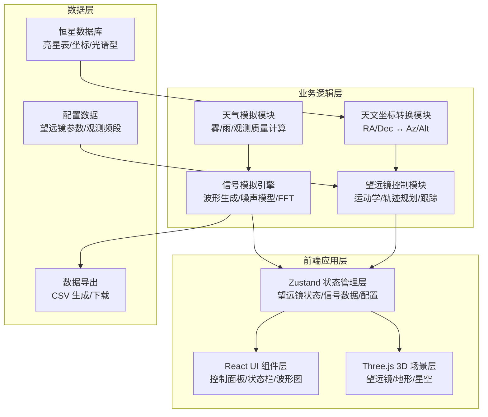

## 1. 架构设计



## 2. 技术描述

- **前端框架**：React 18 + TypeScript 5 + Vite 5
- **3D 引擎**：Three.js r160 + @react-three/fiber 8 + @react-three/drei 9 + @react-three/postprocessing 2
- **状态管理**：Zustand 4
- **样式方案**：Tailwind CSS 3 + 自定义 CSS 变量
- **图标库**：lucide-react
- **数学计算**：原生 Math API + 自定义天文算法
- **音频/信号**：Web Audio API（可选） + Canvas 2D 波形绘制
- **数据可视化**：Canvas 2D（瀑布图、波形图）

## 3. 项目结构

```
src/
├── components/
│   ├── Scene/              # 3D 场景组件
│   │   ├── Telescope.tsx   # 望远镜模型（反射面、馈源舱、钢索）
│   │   ├── Terrain.tsx     # 山谷地形
│   │   ├── StarField.tsx   # 星空背景
│   │   └── Weather.tsx     # 天气效果（雾、雨）
│   ├── ControlPanel/       # 控制面板
│   │   ├── PointingControl.tsx  # 指向控制
│   │   ├── SignalControl.tsx    # 信号参数
│   │   └── WeatherControl.tsx   # 天气控制
│   ├── Visualization/      # 数据可视化
│   │   ├── Waveform.tsx    # 波形显示
│   │   └── Waterfall.tsx   # 瀑布图
│   ├── StatusBar/          # 状态栏
│   │   └── TelescopeStatus.tsx
│   └── UI/                 # 通用 UI
│       ├── GlassPanel.tsx
│       └── GlowButton.tsx
├── hooks/
│   ├── useTelescopeControl.ts  # 望远镜控制逻辑
│   ├── useSignalSimulation.ts  # 信号模拟逻辑
│   ├── useAstronomy.ts         # 天文坐标计算
│   └── useWeather.ts           # 天气效果
├── store/
│   └── useTelescopeStore.ts    # Zustand 状态管理
├── utils/
│   ├── astronomy.ts        # 天文算法
│   ├── coordinates.ts      # 坐标转换
│   ├── signal.ts           # 信号生成
│   └── csv.ts              # CSV 导出
├── data/
│   ├── stars.ts            # 恒星数据
│   └── config.ts           # 配置参数
├── types/
│   └── index.ts            # TypeScript 类型定义
├── App.tsx
├── main.tsx
└── index.css
```

## 4. 核心状态模型

```typescript
// 望远镜状态
interface TelescopeState {
  // 指向
  azimuth: number;           // 方位角 (0-360°)
  altitude: number;          // 高度角 (0-90°)
  targetRA: number;          // 目标赤经 (时)
  targetDec: number;         // 目标赤纬 (度)
  feedPosition: Vector3;     // 馈源舱位置
  isMoving: boolean;         // 是否在运动中
  isTracking: boolean;       // 是否在跟踪目标
  
  // 信号参数
  frequency: number;         // 观测频率 (MHz)
  gain: number;              // 增益 (dB)
  signalMode: 'sine' | 'pulse';
  
  // 接收数据
  waveformData: number[];    // 波形采样数据
  spectrumData: number[][];  // 瀑布图历史数据
  isRecording: boolean;      // 是否在记录数据
  
  // 环境
  weather: 'clear' | 'fog' | 'rain';
  observationQuality: number;  // 观测质量评分 (0-100)
  
  // 漂移扫描
  driftScanMode: boolean;
  driftScanRate: number;      // 地球自转角速度 (°/s)
  
  // 操作方法
  setPointing: (az: number, alt: number) => void;
  setTarget: (ra: number, dec: number) => void;
  setSignalParams: (freq: number, gain: number) => void;
  toggleRecording: () => void;
  setWeather: (w: WeatherType) => void;
  toggleDriftScan: () => void;
  exportData: () => void;
}
```

## 5. 核心算法

### 5.1 天文坐标转换

**地平坐标 ↔ 赤道坐标转换**：

```
已知：观测站经纬度 (λ, φ)，儒略日 JD

时角计算：HA = LST - RA
  LST = LST0 + (JD - JD0) × 1.00273790935

赤道转地平：
  sin(Alt) = sin(Dec)·sin(φ) + cos(Dec)·cos(φ)·cos(HA)
  cos(Az) = [sin(Dec) - sin(Alt)·sin(φ)] / [cos(Alt)·cos(φ)]
  sin(Az) = -cos(Dec)·sin(HA) / cos(Alt)
```

### 5.2 馈源舱运动学

**六索并联机构运动学**：
- 给定馈源舱目标位置 P(x,y,z)
- 计算每根钢索长度 Lᵢ = |P - Aᵢ|，Aᵢ 为第 i 个塔顶锚点
- 插值计算运动轨迹（三次贝塞尔曲线）
- 约束：最大运动速度 1 m/s，钢索张力限制

### 5.3 信号模拟

**信号模型**：
```
信号 = 目标信号 + 系统噪声 + 天气衰减
目标信号：A·sin(2πft + φ) 或 高斯脉冲序列
噪声模型：高斯白噪声 N(0, σ²)
天气衰减：
  晴天：衰减 0.5 dB
  雾天：衰减 2-5 dB
  雨天：衰减 5-15 dB（与频率相关）
```

**瀑布图生成**：
- 每 100ms 对 1024 点采样做 FFT
- 频率分辨率：采样率/1024
- 颜色映射：dB 值 → HSL 色彩空间
- 滚动更新：最新频谱插入顶部

### 5.4 观测质量评分

```
质量分 = 100 × w1×(1 - 天气衰减/20) + w2×(1 - |指向误差|/1°) + w3×(1 - 增益偏差/20dB)
  w1 = 0.5, w2 = 0.3, w3 = 0.2
```

## 6. 性能优化策略

1. **3D 性能**：
   - 星空使用 BufferGeometry + Points，单次绘制调用
   - 地形使用 InstancedMesh 低多边形
   - 钢索使用动态更新的 LineGeometry

2. **Canvas 可视化**：
   - 波形图使用 requestAnimationFrame 节流
   - 瀑布图使用 ImageData 批量像素更新
   - 历史数据使用环形缓冲区，避免频繁内存分配

3. **状态更新**：
   - Zustand 细粒度订阅，避免不必要重渲染
   - 3D 场景与 UI 状态分离更新

4. **数据导出**：
   - 使用 Blob + URL.createObjectURL，避免大字符串阻塞
   - 流式生成 CSV，支持大数据量导出
